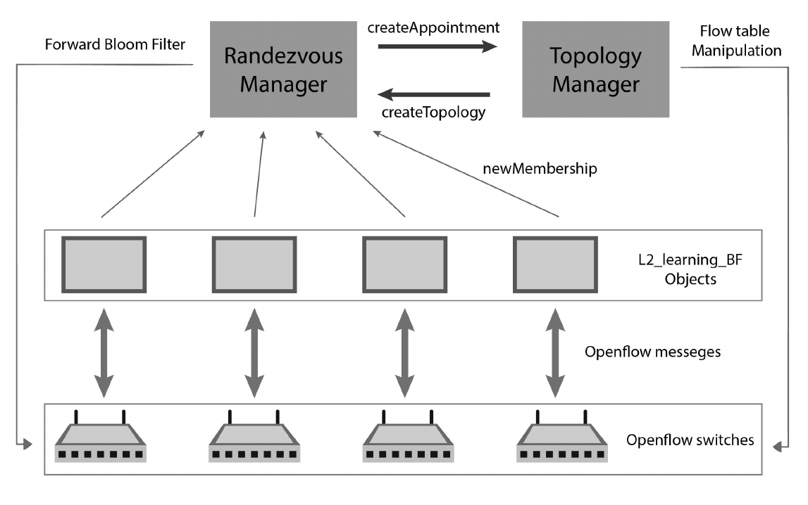

# Bloom Filter-Based Multicast for Information Centric Networks

This repository contains a description along with the core code segments utilized in my Bachelor thesis. 
The research was conducted in the context of the European project
[“Point: iP Over IcN – the betTer ip"](https://cordis.europa.eu/project/id/643990). 

For those interested in experimenting with my prototype, please feel free to contact me, and I will provide you with a Linux-based 
virtual box containing a preconfigured and set-up environment.

## High Level Architecture

This work focuses on creating a prototype system that enables multicast capabilities by leveraging the bloom filter structure. The proposed system adopts a Publish-Subscribe architecture (pub-sub), where users wishing to provide
content are referred to as publishers, and those seeking to consume it are called subscribers.

The components of our system include::
* **Rendezvous Manager**: A centralized component that manages the state of the users, maintaining an updated
    mapping of publishers/subscribers-channels.
* **Topology Manager**: A centralized entity responsible for maintaining an up-to-date network graph.
    It communicates with the Rendezvous Manager in order to generate bloom filters used for message routing.
    These bloom filters are then distributed to all involved Openflow switches.
* **Openflow Switches**: These are the switching devices responsible for forwarding messages by creating forwarding rules based on
    the received bloom filters from the Topology Manager. Additionally, switches utilize the OpenFlow protocol to 
    forward packets containing publisher/subscriber requests, encapsulated in custom packets, to the Rendezvous Manager.

The architecture of our system is presented in the following figure.
\
\

One potential application of this work is in Web-based IPTV. In this scenario, channel providers can register as publishers, 
delivering their broadcasts to interested subscribers who meet the specified requirements.

The system was built by utilizing the Software-Defined-Networking (SDN) approach and was deployed within
a mininet simulated network.

## Utilizing Bloom Filters

The generation of bloom filters is conducted as follows. Initially, each link in the network graph is assigned a unique 
126-bit binary number, referred to as the link ID. The Topology Manager generates a tree containing the shortest paths 
between the publisher and subscriber nodes. The bloom filter, employed for multicast message transmission, is constructed by performing a bitwise OR operation on the link IDs of all the links in the derived tree.

A bloom filter is inserted into all packets transmitted by the corresponding publisher. A router determines the links to forward a 
packet to by checking the result of the condition Bloom_Filter AND Link_ID = Link_ID.

